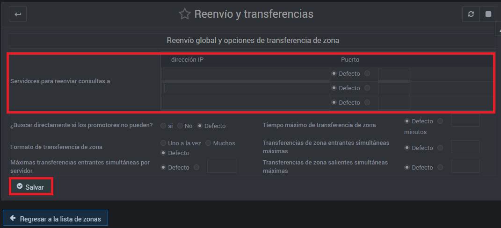
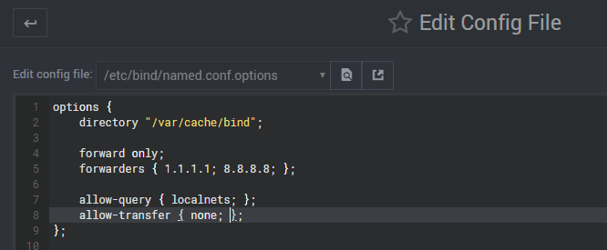
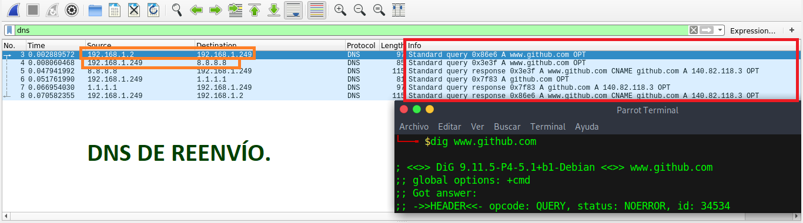

# ¿Cómo configurar un servidor DNS de Reenvío?

En esta página se explicará cómo realizar una configuración sobre la máquina virtual UbuntuServer 16.04.5, para configurar un servidor DNS de Reenvío utilizando el servicio Webmin y luego la comprobación de su funcionamiento..

El objetivo de esta práctica es que el alumnado sepa y entienda cómo configurar un servidor DNS de Reenvío, para luego, diferenciar todos los tipos DNS conocidos.

# Configurar un servidor DNS de Reenvío.

1.- Vamos a la página de Webmin y seleccionaremos las página de configuración de BIND9.

2.- En la página de configuración del servidor DNS BIND9, vamos a dar click en "Edit Config File".

3.- Arriba, encontraremos una frase que dice "Edit config file:", pues nos desplazaremos un poco a la derecha. Para poder desplegar y seleccionamos: <**/etc/bind/named.conf.options**>.

4.- En ese archivo de configuración, vamos a eliminar todos los comentarios, es decir, todas las líneas que empiecen por "**//**".

Y lo sustituimos por:
  forward only;
  forwarders { 1.1.1.1; 8.8.8.8; };
  
  allow-query { localnets; };
  allow-transfer { none; };
  
  Como aparece en la siguiente imagen:

Lo que hemos hecho usando esto es:

  Variable | Funcionalidad
------------ | ------------- 
 forwarders { 1.1.1.1; 8.8.8.8; }; | Establece las IPs de los otros servidores DNS, que nos responderán nuestros solicitudes.
 allow-recursion {localnets;}; | Permite la recursión a los equipos locales.
 allow-transfer {none;}; | Deniega la transferencia a los host.

## Comprobar el funcionamiento del DNS de Reenvío

Para probar el pleno funcionamiento del DNS de Reenvío, debemos usar el sniffer **WireShark**.

Como podemos observar en la siguiente imagen, el DNS de Reenvío, funciona correctamente, ya que, un cliente ha hecho una solicitud para que le den la IP de www.github.com . Nuestro servidor, como lo sabe, lo que ha hecho es reenviar la solicitud a las IPs que le hemos establecido en _forwarders { 1.1.1.1; 8.8.8.8; };__

Por lo tanto, nuestro servidor DNS de Reenvío está funcionando correctamente, ya que, nos responde a las peticiones que hace el cliente y en vez de buscar recursivamente, se las manda a otra IP.

[Volver a la Página Principal](README.md)
