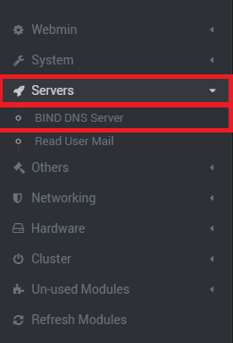
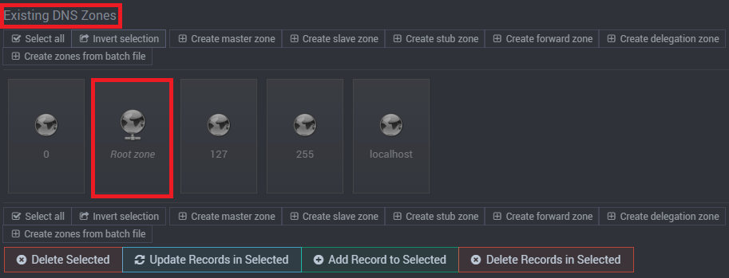
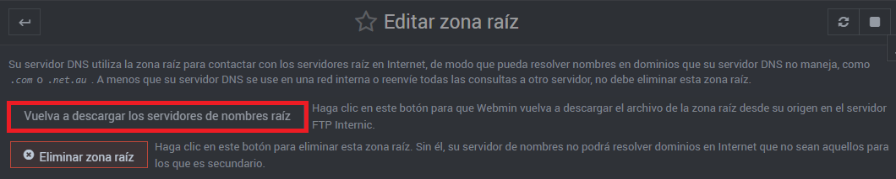
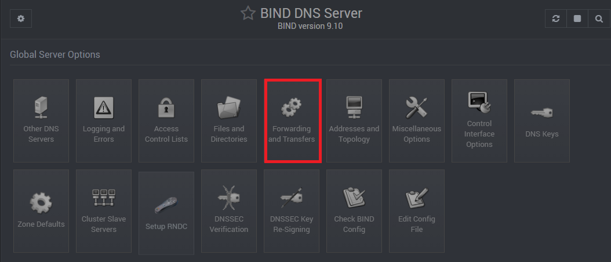
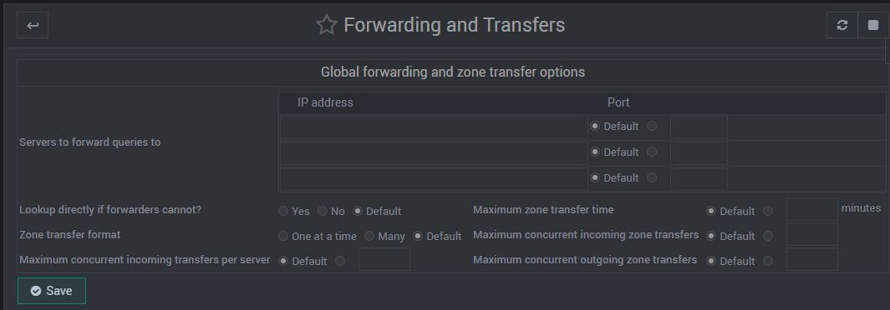
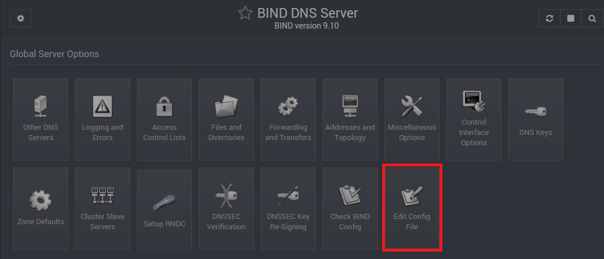
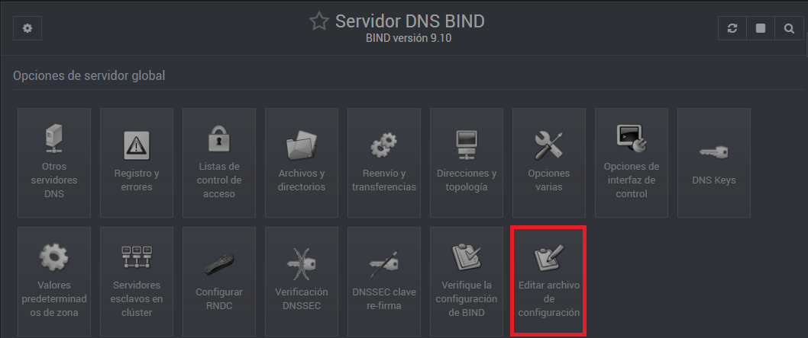
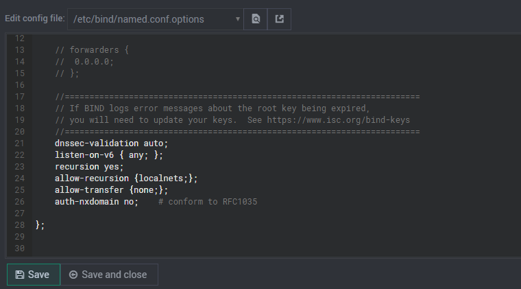
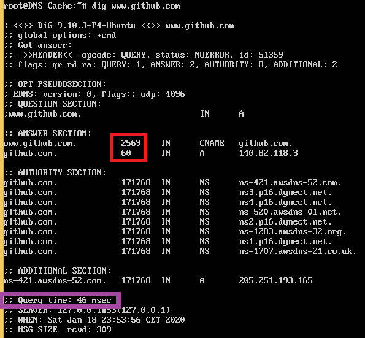

# Cómo configurar un Solo Caché.

En está página web, se realizará una configuración sobre la máquina UbuntuServer 16.04.5, para configurar y comprobar el funcionamiento de un servidor DNS De Solo Caché utilizando el servicio Webmin.

En esta práctica, tiene como objetivo enseñar al alumnado la configuración de un servidor DNS de Solo Caché y diferenciar los distintos tipos de servidores DNS.

## Configuración DNS.

1.- Vamos a Webmin y entramos en la página de configuración de BIND9.

2.- Daremos click en **"Root Zone"**, en el apartado de <**Existing DNS Zones**>.

3.- Y daremos al botón "**Re-Download Root Nameservers**", una vez dado procederemos a ir a la página por defecto que da Bind9

2.- Luego, vamos a "**Forwarding and Transfers**".

3.- Dónde dice "**Server to forward queries to**", borramos todas las IP que aparezcan, para que no haya ninguna IP de otros servidores DNS, ya que, usaremos las respuestas recursivas y le daremos a "**Save**".

4.- Ahora, vamos a la página de configuración de Bind9 y escogeremos "**Edit Config File**".

5.- A continuación, nos situamos un poco a la derecha de dónde dice "**Edit Config File**", ya que, podremos desplegar una lista, pues  escogeremos: <**/etc/bind/named.conf.options**>.

6.- Vamos al final de ese fichero, y escribiremos debajo de <**dnssec-validation auto;**>:

   listen-on-v6 { any; };
   
   recursion yes;
   
   allow-recursion {localnets;};
    
   allow-transfer {none;};
   
  De tal forma, que quede así:
  
  
  Y daremos en **"Save**".
  
  Lo que hemos hecho anteriormente es:
 
  Variable | Funcionalidad
------------ | -------------
 listen-on-v6 { any; }; | A qué direcciones locales se les permite realizar consultas AAAA (IPv6).
 recursion yes; | Permite activar la recursividad para consultar a los servidores raíz.
 allow-recursion {localnets;}; | Permite la recursión a los equipos locales.
 allow-transfer {none;}; | Deniega la transferencia a los host.

  
  7.- Por último paso, reiniciamos el servicio de Bind9 para comprobar que todo funcione y se apliquen los cambios realizados.
 
 
  
  ## Comprobar funcionamiento del DNS Solo Caché.

Para comprobar el funcionaiento del DNS de Solo Caché, hay que tener como mínimo 1 cliente, para realizarle peticiones DNS junto con nuestro servidor.

**NOTA**: _Es necesario el cliente para evitar malentendidos, ya que si lo hacemos siempre en el servidor, no podemos descubrir si funciona la caché del bind9, porque se puede sustutir por la propia caché de la máquina virtual._

Empezamos con el servidor UbuntuServer, realizamos un **dig** a una dirección, en mi caso, www.github.com y aparece esto:

Si nos fijamos bien en la imagen anterior en las zonas marcados con cuadrados de colores, el cuadrado rojo representa el tiempo que está en caché (en segundos) la petición, por si otro cliente realiza la misma petición. Y el cuadrado morado, representa el tiempo que hemos tenido que esperar para que nuestra consulta sea respondida (en milisegundos).

Pero en la imagen que aparece a continuación, hecha desde otra máquina (por un cliente al servidor DNS), a escasos segundos de la imagen anterior, se puede apreciar por los cuadrados de colores, que tanto el tiempo de respuesta, como el tiempo de la caché (TTL) han bajado, produciendo que todo funcione correctamente.

![Me deprimo si me suspendesImagenes/Caché/Configuración/cache compr2.PNG

